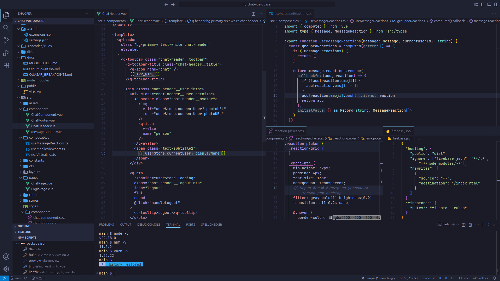

# 🌆 Tokyo Night Modern

> **Beautiful modern dark theme** for VS Code with carefully crafted colors and contemporary design.



## 🎨 Overview

A **Tokyo Night dark theme** featuring:

- **12 base colors** → **406 workbench UI colors** (programmatically generated)
- **WCAG compliant** contrast ratios for accessibility
- **Zero hardcoded colors** — centralized palette system
- **Modern TypeScript architecture** with full test coverage

---

### 🌎 Demo

🔮 [TRY ONLINE](https://vscode.dev/theme/lod-inc.tokyo-night-modern) 🔮

---

### 🚀 Quick Start

1. Open VS Code Extensions (`Ctrl+Shift+X`)
2. Search "Tokyo Night Modern"
3. Install and select **Tokyo Night Modern**

---

### 🏗️ Architecture

```text
12 base colors → 406 workbench colors → 13 syntax tokens
```

```text
src/
├── core/           # Base palette + color utilities
├── generators/     # Theme generation logic
├── types/          # TypeScript definitions
└── build.ts        # Main build script
```

---

### 🛠️ Development

```bash
git clone https://github.com/darqus/tokyo-night-modern-vscode-theme.git
cd tokyo-night-modern-vscode-theme
npm install
npm run build         # Build theme (~0.7–1.0s)
npm test              # Run unit tests (49+ tests)
npm run validate:all  # Validate theme schema + run tests
npm run test:coverage # Coverage report (expect ~100% / ~97% branches)
```

---

### 📊 Metrics

| Metric | Value | Status |
|--------|-------|--------|
| **Base colors** | 12 | ✅ |
| **Workbench colors** | 406 | ✅ |
| **Syntax tokens** | 13 | ✅ |
| **Tests** | 49 | ✅ |
| **Build time** | ~0.7–1.0s | ✅ |
| **Hardcoded colors** | 0 | ✅ |

---

### 📚 Documentation

- [Quick Start](docs/QUICK_START.md) - Installation and setup
- [Development](docs/DEVELOPMENT.md) - Build and contribute
- [Colors](docs/COLORS.md) - Color palette reference
- [Theme Analysis](docs/THEME_ANALYSIS.md) - Architecture deep dive
- [Release & Versioning](docs/RELEASE_VERSIONING.md) - Automated releases and version rules
- [Contributing](docs/CONTRIBUTING.md) - Guidelines for contributing

---

### 📄 License

MIT License - see [LICENSE](LICENSE) for details.

---

### 🌆 Tokyo Night Modern theme

Crafted with ❤️ for developers

⭐ [GitHub](https://github.com/darqus/tokyo-night-modern-vscode-theme)

📦 [Marketplace](https://marketplace.visualstudio.com/items?itemName=lod-inc.tokyo-night-modern)
