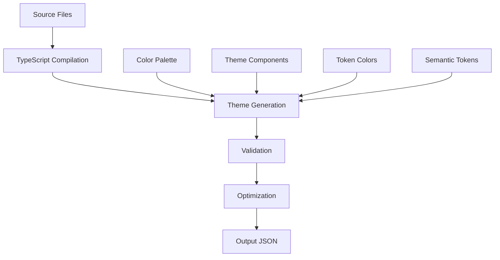

# 🏗️ Architecture Guide

> Detailed overview of Tokyo Night Lod theme architecture and design principles.

## 🎯 Architecture Overview

The Tokyo Night Lod theme follows a modern, modular architecture designed for:

- **Maintainability** - Clear separation of concerns
- **Scalability** - Easy to extend and modify
- **Type Safety** - Full TypeScript support
- **Performance** - Optimized build process
- **Consistency** - Single source of truth for colors

### Core Principles

1. **Single Source of Truth** - All colors defined in one place
2. **Type Safety** - TypeScript for all color structures
3. **Modularity** - Clear separation of theme components
4. **Automation** - Automated build and validation
5. **Testing** - Comprehensive test coverage

## 📁 Project Architecture

### High-Level Structure

```
tokyo-night-vscode-theme-lod/
├── src/                    # Source code (TypeScript)
│   ├── palette.ts          # Central color palette
│   ├── build.ts            # Theme generator
│   ├── tokenColors.ts      # Syntax highlighting
│   ├── semanticTokenColors.ts # Semantic tokens
│   ├── components/         # Reusable components
│   ├── theme/              # Theme modules
│   ├── utils/              # Utility functions
│   ├── types/              # TypeScript types
│   ├── validation/         # Validation logic
│   └── variants/           # Theme variants
├── themes/                 # Generated themes (JSON)
├── scripts/                # Build and automation scripts
├── tests/                  # Test files
└── docs/                   # Documentation
```

### Component Architecture

#### 1. Color System (`src/palette.ts`)

```typescript
// Central color palette - single source of truth
export const palette = {
  // Base colors
  base: {
    black: '#1a1b26',
    dark0: '#16161e',
    dark1: '#1f2336',
    dark2: '#24283b',
    dark3: '#292e42',
    // ... more base colors
  },

  // UI colors
  ui: {
    background: '#1a1b26',
    foreground: '#a9b1d6',
    selection: '#33467C',
    // ... more UI colors
  },

  // Syntax colors
  syntax: {
    keyword: '#bb9af7',
    string: '#9ece6a',
    comment: '#565f89',
    // ... more syntax colors
  },

  // Semantic colors
  semantic: {
    variable: '#c0caf5',
    function: '#7aa2f7',
    parameter: '#9d7cd8',
    // ... more semantic colors
  }
};
```

**Benefits**:

- **Consistency** - All colors defined in one place
- **Maintainability** - Easy to update colors globally
- **Type Safety** - Full TypeScript support
- **Validation** - Automated color validation

#### 2. Theme Generator (`src/build.ts`)

```typescript
// Main theme builder
import { palette } from './palette';
import { tokenColors } from './tokenColors';
import { semanticTokenColors } from './semanticTokenColors';
import { activityBar } from './theme/activityBar';
import { editor } from './theme/editor';
// ... other imports

export function buildTheme(): VSCodeTheme {
  return {
    name: 'Tokyo Night Lod',
    type: 'dark',
    colors: {
      // UI colors from palette
      'activityBar.background': palette.ui.background,
      'editor.background': palette.ui.background,
      'editor.foreground': palette.ui.foreground,
      // ... more UI colors
    },
    tokenColors: tokenColors,
    semanticTokenColors: semanticTokenColors,
    // ... other theme properties
  };
}
```

**Benefits**:

- **Automation** - Automated theme generation
- **Consistency** - Ensures all components use same colors
- **Validation** - Built-in validation during build
- **Flexibility** - Easy to add new theme variants

#### 3. Theme Components (`src/theme/`)

```typescript
// src/theme/editor.ts
import { palette } from '../palette';

export const editor = {
  // Editor-specific colors
  background: palette.ui.background,
  foreground: palette.ui.foreground,
  lineHighlight: palette.base.dark2,
  selection: palette.ui.selection,
  // ... more editor colors
};

// src/theme/activityBar.ts
import { palette } from '../palette';

export const activityBar = {
  // Activity bar colors
  background: palette.ui.background,
  foreground: palette.ui.foreground,
  activeBackground: palette.base.dark1,
  // ... more activity bar colors
};
```

**Benefits**:

- **Modularity** - Each UI component in separate file
- **Maintainability** - Easy to update specific components
- **Consistency** - All components use central palette
- **Type Safety** - Full TypeScript support

#### 4. Syntax Highlighting (`src/tokenColors.ts`)

```typescript
// Syntax highlighting rules
export const tokenColors: TokenColor[] = [
  {
    name: 'Comments',
    scope: ['comment', 'punctuation.definition.comment'],
    settings: {
      foreground: palette.syntax.comment,
      fontStyle: 'italic'
    }
  },
  {
    name: 'Keywords',
    scope: ['keyword', 'storage.type'],
    settings: {
      foreground: palette.syntax.keyword
    }
  },
  {
    name: 'Strings',
    scope: ['string', 'meta.string'],
    settings: {
      foreground: palette.syntax.string
    }
  },
  // ... more syntax rules
];
```

**Benefits**:

- **Comprehensive** - Covers all major programming languages
- **Consistent** - Uses central color palette
- **Extensible** - Easy to add new language support
- **Type Safety** - Full TypeScript support

#### 5. Semantic Tokens (`src/semanticTokenColors.ts`)

```typescript
// Semantic token rules
export const semanticTokenColors: SemanticTokenColors = {
  enabled: true,
  rules: {
    // Variable types
    variable: {
      foreground: palette.semantic.variable,
      fontStyle: ''
    },
    // Function types
    function: {
      foreground: palette.semantic.function,
      fontStyle: ''
    },
    // Parameter types
    parameter: {
      foreground: palette.semantic.parameter,
      fontStyle: ''
    },
    // ... more semantic rules
  }
};
```

**Benefits**:

- **Modern** - Uses VS Code's semantic token system
- **Intelligent** - Language-aware highlighting
- **Consistent** - Uses central color palette
- **Extensible** - Easy to add new semantic rules

## 🔄 Build Process

### Build Pipeline



### Build Steps

1. **TypeScript Compilation**:

   ```bash
   # Compile TypeScript to JavaScript
   tsc --project tsconfig.json
   ```

2. **Theme Generation**:

   ```typescript
   // Generate theme from source
   const theme = buildTheme();
   ```

3. **Validation**:

   ```typescript
   // Validate theme structure
   const validation = validateTheme(theme);
   if (!validation.isValid) {
     throw new Error('Theme validation failed');
   }
   ```

4. **Optimization**:

   ```typescript
   // Optimize theme for performance
   const optimizedTheme = optimizeTheme(theme);
   ```

5. **Output**:

   ```typescript
   // Write to JSON file
   fs.writeFileSync(
     'themes/tokyo-night-dark-color-theme.json',
     JSON.stringify(optimizedTheme, null, 2)
   );
   ```

### Build Scripts

```json
{
  "scripts": {
    "build": "npm run clean && npm run compile && npm run generate",
    "clean": "rimraf themes/*.json",
    "compile": "tsc",
    "generate": "node dist/build.js",
    "validate": "npm run build && npm run test:validation",
    "watch": "npm run build -- --watch"
  }
}
```

## 🎨 Color System Architecture

### Color Categories

```typescript
interface ColorPalette {
  // Base colors - foundation of the theme
  base: {
    black: string;      // #000000 equivalent
    dark0: string;      // Darkest background
    dark1: string;      // Dark background
    dark2: string;      // Medium background
    dark3: string;      // Light background
    light0: string;     // Dark foreground
    light1: string;     // Medium foreground
    light2: string;     // Light foreground
    light3: string;     // Lightest foreground
    white: string;      // #FFFFFF equivalent
  };

  // UI colors - interface elements
  ui: {
    background: string;    // Main background
    foreground: string;    // Main foreground
    selection: string;     // Selection background
    border: string;        // Border colors
    shadow: string;        // Shadow colors
    accent: string;        // Accent/highlight colors
  };

  // Syntax colors - code highlighting
  syntax: {
    keyword: string;      // Keywords (if, for, etc.)
    string: string;       // String literals
    comment: string;      // Comments
    number: string;       // Numbers
    operator: string;     // Operators (+, -, *, /)
    punctuation: string;   // Punctuation (., ;, etc.)
    variable: string;     // Variables
    function: string;     // Functions
    type: string;         // Types
    constant: string;     // Constants
  };

  // Semantic colors - semantic tokens
  semantic: {
    variable: string;     // Variables
    function: string;
